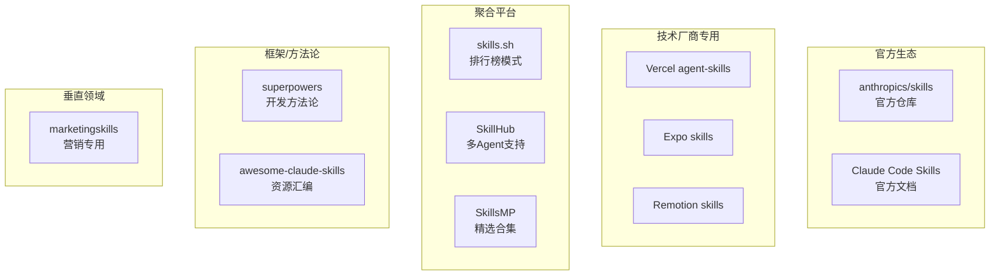
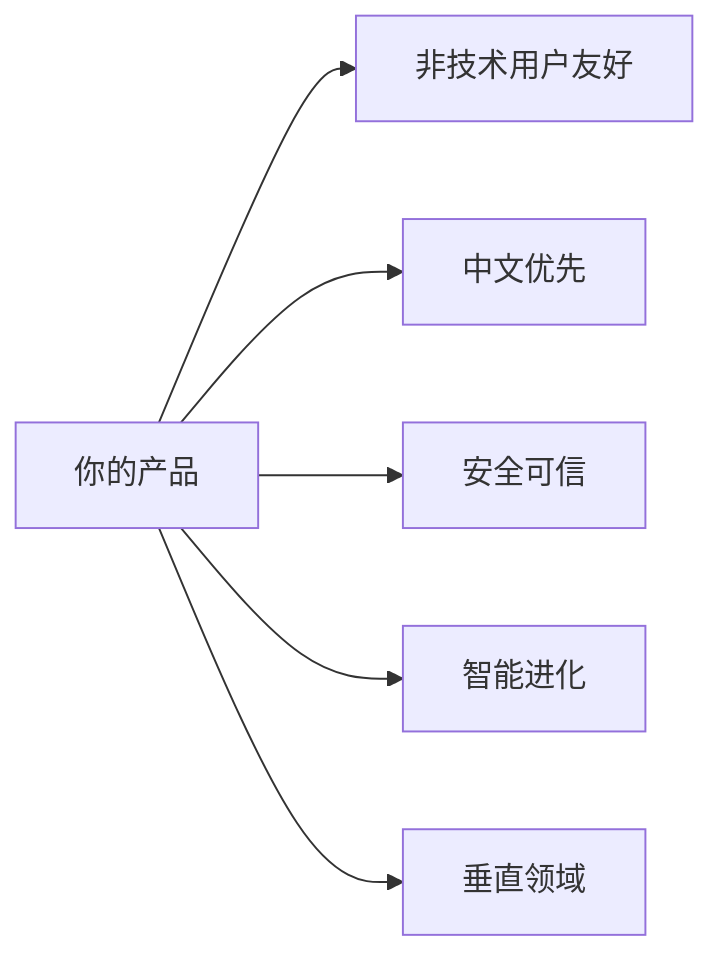

# Skill 平台竞品深度分析报告

## 一、竞品全景地图

---

## 二、各竞品详细分析

### 1. anthropics/skills（官方仓库）

| 维度 | 分析 |
|------|------|
| **定位** | Skill 规范制定者 + 示例库 |
| **特点** | 包含官方 Skill 规范、示例 Skill、模板；涵盖 Creative & Design、Development、Enterprise、Document Skills 等分类 |
| **亮点** | 开源了 Claude 文档功能（docx/pdf/pptx/xlsx）的源码作为参考 |
| **不足** | 纯 GitHub 仓库，无可视化界面，无安装工具 |
| **Star** | 基准参考 |

> **核心价值**：规范定义权 + 官方背书

---

### 2. skills.sh（聚合平台）

| 维度 | 分析 |
|------|------|
| **定位** | Skill 发现与排行榜平台 |
| **特点** | 一键安装命令 `npx skills add <owner/repo>`；排行榜（All Time / Trending / Hot）；聚合 36,000+ 安装量 |
| **亮点** | 最简安装体验、社区热度可视化、支持 GitHub 仓库直接安装 |
| **不足** | 纯聚合，无审核机制；无 Playground 试用功能 |
| **差异化** | 排行榜驱动发现，类似 npm 的体验 |

> **核心价值**：发现性 + 安装便捷性

---

### 3. SkillHub（中国市场 + 多Agent支持）

| 维度 | 分析 |
|------|------|
| **定位** | 企业级 Skill 解决方案，面向开发者和企业 |
| **特点** | 支持 Claude / Codex / Gemini / OpenCode 多Agent；7000+ AI 评分的 Skill；提供 Playground 在线试用；Skill Stacks（技能组合包）概念；Pro 会员付费模式 |
| **亮点** | 多 Agent 兼容、Playground 试用、技能组合包、语义搜索 |
| **不足** | 界面偏向开发者，非技术用户门槛 |
| **差异化** | 唯一支持多 Agent 平台的聚合站 |

> **核心价值**：跨 Agent 兼容 + 商业化模式探索

---

### 4. SkillsMP（精选合集）

| 维度 | 分析 |
|------|------|
| **定位** | 中文精选 Skill 合集 |
| **特点** | 中文界面、精选策略（非全量聚合） |
| **状态** | 网站访问受限（403），信息有限 |
| **差异化** | 中文本地化 |

---

### 5. awesome-claude-skills（Composio）

| 维度 | 分析 |
|------|------|
| **定位** | Skill 资源汇编 + Composio 生态推广 |
| **特点** | 标准 awesome-list 格式；按类别整理（Document Processing, Development, Data, Marketing, Creative, Security 等）；包含创建 Skill 的模板和最佳实践 |
| **亮点** | 快速入门指南：3 步连接 500+ 应用（通过 Composio MCP） |
| **不足** | 静态列表，无动态排行，无安装工具 |
| **差异化** | 绑定 Composio MCP 生态，强调应用连接能力 |

> **核心价值**：教育 + 导流到 Composio 生态

---

### 6. superpowers（开发方法论）

| 维度 | 分析 |
|------|------|
| **定位** | 完整的 AI 辅助软件开发工作流 |
| **特点** | 不只是 Skill 集合，而是一套方法论；Skills Library 包括：TDD、Debugging、Collaboration、Meta 等类别；支持 Claude Code、Codex、OpenCode 等多平台安装 |
| **亮点** | **方法论驱动**：test-driven-development、systematic-debugging、subagent-driven-development 等；配套的工作流指导（brainstorming → writing-plans → executing-plans） |
| **不足** | 偏专业开发者，学习曲线 |
| **差异化** | 唯一以"开发方法论"为核心的 Skill 框架 |

> **核心价值**：从"工具集"升级到"工作方式"

---

### 7. Vercel agent-skills（官方技术栈）

| 维度 | 分析 |
|------|------|
| **定位** | Vercel 官方 Skill 集合 |
| **特点** | react-best-practices、web-design-guidelines、react-native-guidelines、composition-patterns、vercel-deploy-claimable |
| **亮点** | 官方最佳实践、与 Vercel 部署深度集成 |
| **差异化** | 绑定 Vercel 技术栈，官方权威 |

> **核心机会**：技术厂商官方 Skill 是重要内容来源

---

### 8. Expo skills（官方技术栈）

| 维度 | 分析 |
|------|------|
| **定位** | Expo/React Native 官方 Skill |
| **特点** | 针对 Expo 和 EAS 服务的专用 Skill |
| **安装** | 支持 Claude Code、Cursor、Any agent |
| **差异化** | React Native 移动开发专用 |

---

### 9. marketingskills（垂直领域）

| 维度 | 分析 |
|------|------|
| **定位** | 营销专用 Skill 集合 |
| **特点** | 6 种安装方式；分类：Conversion Optimization、Content & Copy、SEO & Discovery、Paid & Distribution、Measurement & Testing、Growth Engineering、Strategy & Monetization |
| **亮点** | 非编程领域的 Skill 典范；支持 Fork 自定义 |
| **差异化** | **唯一面向非开发者（营销人员）的 Skill 集合** |

> **核心洞察**：证明 Skill 可以超越编程领域

---

### 10. remotion-dev/skills（视频生成）

| 维度 | 分析 |
|------|------|
| **定位** | Remotion 视频生成框架的官方 Skill |
| **特点** | 教 Claude 如何使用 Remotion 生成视频 |
| **差异化** | 创意/多媒体领域 |

---

### 11. Claude Code Skills（官方文档）

| 维度 | 分析 |
|------|------|
| **定位** | Skill 官方技术规范 |
| **核心功能** | 创建 Skill、配置 frontmatter、支持文件、控制触发条件、工具权限限制、参数传递、动态上下文注入、Subagent 运行、组织级管理部署 |
| **分享机制** | Project skills（版本控制）、Plugins、Managed（组织级部署） |

---

## 三、市场格局总结

### 竞品分类矩阵

|  | 技术门槛低 | 技术门槛高 |
|--|-----------|-----------|
| **通用** | skills.sh、SkillHub | superpowers、awesome-claude-skills |
| **垂直** | marketingskills | Vercel/Expo/Remotion 官方 |

### 当前市场空白

| 空白领域 | 说明 |
|----------|------|
| **非技术用户友好平台** | 目前所有平台都需要命令行或编辑文件 |
| **中文生态** | SkillsMP 是唯一尝试但访问受限，SkillHub 有中文但侧重开发者 |
| **安全审核机制** | 没有平台提供 Skill 安全性验证 |
| **Skill 进化/学习** | 所有 Skill 都是静态的，无自适应能力 |
| **评价/评论系统** | skills.sh 有安装量但无用户评价 |
| **垂直领域拓展** | 除营销外，教育、设计、办公等领域空白 |

---

## 四、产品设计建议

### 核心差异化方向

### 建议功能优先级

| 优先级 | 功能 | 理由 |
|--------|------|------|
| P0 | **可视化安装/配置** | 解决非技术用户门槛问题 |
| P0 | **Playground 试用** | SkillHub 已验证有效，降低决策成本 |
| P1 | **中文本地化** | 市场空白，差异化明显 |
| P1 | **安全评级系统** | 信任是用户核心诉求 |
| P1 | **用户评价/评论** | 社区信任建设 |
| P2 | **Skill Stacks（组合包）** | SkillHub 的创新，值得借鉴 |
| P2 | **使用数据分析** | 为智能进化打基础 |
| P3 | **Skill 自动优化** | 前沿探索，长期差异化 |
| P3 | **垂直领域拓展** | 教育、设计、办公自动化等 |

### 商业模式参考

| 模式 | 参考 | 说明 |
|------|------|------|
| **Freemium** | SkillHub Pro | 基础免费，高级功能付费 |
| **创作者分成** | GPT Store | 优质 Skill 创作者获得收益 |
| **企业订阅** | SkillHub Enterprise | 组织级 Skill 管理、私有部署 |

---

## 五、关键洞察

> [!IMPORTANT]
> ### 1. Skill 生态正在从"开发者工具"走向"通用能力扩展"
> marketingskills 证明非编程领域有巨大需求

> [!IMPORTANT]
> ### 2. "方法论 > 工具集"的趋势
> superpowers 的成功说明用户需要的不只是工具，而是工作方式

> [!IMPORTANT]
> ### 3. 多 Agent 兼容是未来方向
> SkillHub 支持 Claude/Codex/Gemini/OpenCode，降低用户锁定焦虑

> [!TIP]
> ### 4. 中文市场机会巨大
> 目前没有成熟的中文 Skill 平台，是明显的差异化机会

> [!WARNING]
> ### 5. 安全和信任是核心阻碍
> 目前没有平台解决 Skill 安全性验证问题
